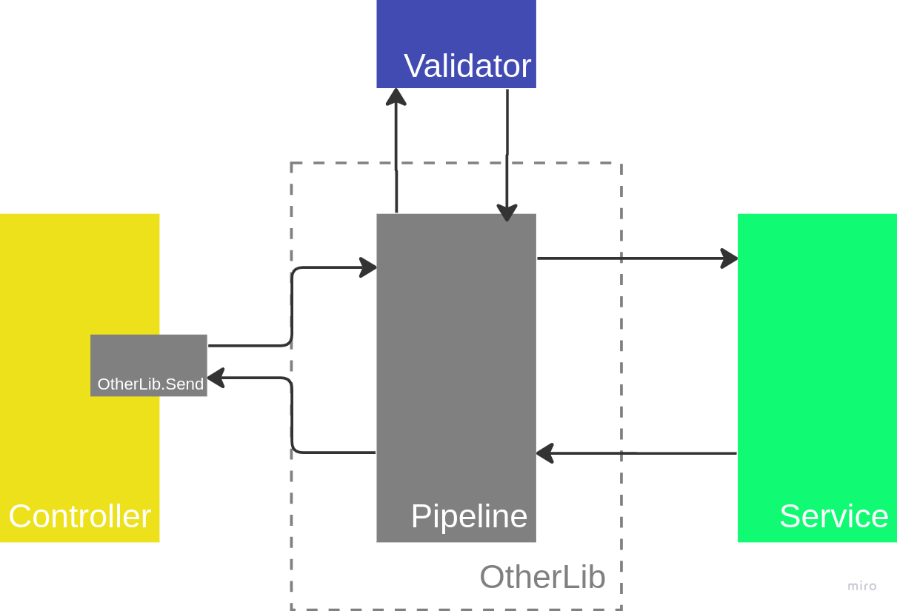

# Não deixe de lado suas responsabilidades

Não deixe nas mãos de bibliotecas de terceiros suas responsabilidades.

Recentemente, estava avaliando um pull request quando me deparei com uma implementação que, a princípio, parecia interessante tanto para economizar linhas de código quanto para centralizar as validações de dados que esta aplicação estava recebendo.

Abaixo vamos falar sobre essa implementação que considero problemática, usando como exemplo um código escrito em `C#`.

> É importante ressaltar que o conceito do que iremos discutir se aplica a qualquer linguagem de programação ou plataforma.

Como mencionado anteriormente, em uma determinada aplicação, estávamos utilizando `MediatR` e `FluentValidation`, duas bibliotecas bastante populares no universo `.NET Core`. No caso em questão, estávamos usando o conceito de `pipeline` do `MediatR`, onde, entre o momento em que chamamos o método `Send` e o momento em que o método `Handler` é executado, interceptamos o `Command` ou `Event`, ambos implementam a interface `IRequest` do `MediatR`.

Ao interceptar o `Command` ou `Event`, verificamos se existe alguma implementação de algum `Validator` do `FluentValidation` para o `Command` ou `Event` no pool de `Validators` do `FluentValidation`. Caso não exista, seguimos o fluxo e chamamos o `Handler`; porém, se existir ao menos um `Validator` do `FluentValidation` para o `Command` ou `Event` no pool de `Validators` do `FluentValidation`, executamos as validações antes de seguir com o fluxo, o que faz com que o `Command` ou `Event` chegue ao seu `Handler`.

Isso parece ótimo em um cenário onde temos que validar a entrada de certo conjunto de dados e garantir que o mesmo conjunto de dados respeite as regras de negócio e afins.

Centralizar a validação com o auxílio do `MediatR` parece ser uma boa opção.

*Exemplo de como centralizamos as validações com o auxílio do `MediatR`*

Mas e se precisarmos mudar a forma como enviamos os `Command` ou `Event`?

Imaginem um cenário em que os `Command` ou `Event` serão enviados e consumidos através de um broker ou de alguma outra biblioteca. Onde vamos validar a entrada deste conjunto de dados?

Teríamos que implementar um novo código que fizesse o mesmo que o `MediatR` nos permite fazer hoje?

*Exemplo de como poderíamos centralizar as validações com o auxílio de outra biblioteca*

Será essa a melhor opção?

Perceba como a facilidade de deixar a responsabilidade de validar nas mãos de bibliotecas terceiras rapidamente pode se tornar um problema.

Penso que a melhor opção é que a camada `Service` dependa da interface `IValidator`. Desta forma, mesmo que tenhamos que alterar a biblioteca responsável por fazer a comunicação entre módulos, nossa camada `Service` continuará fazendo validações e nosso `Core` permanecerá protegido contra mudanças.

*Exemplo de como, mesmo usando `MediatR`, as validações estão sendo executadas na camada `Service`*

*Exemplo de como, mesmo usando outra biblioteca, as validações estão sendo executadas na camada `Service`*

> Não deixe nas mãos de bibliotecas de terceiros suas responsabilidades.
